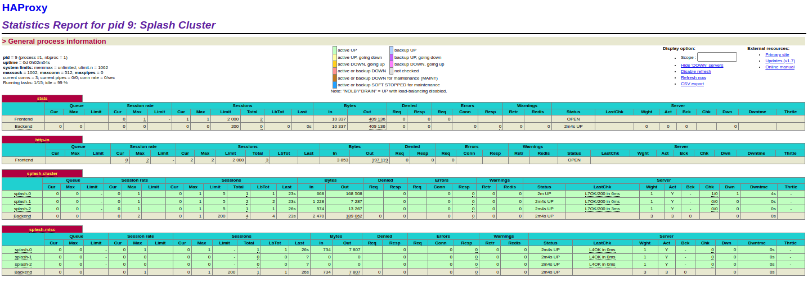

# Splash container Load Balancing With Haproxy and Basic Authentication

- HAProxy as a load balancer layer to N number of docker containers runing splash instances.
- Requests delivered to every containers in  round robin fashion.
- Memory usage limit on every containers, on exceeding limit killed and recreated.

# Setup:
- **Spin up containers:** ``docker-compose up``
- **Remove containers:** ``docker-compose down``

- Splash: ``http://localhost:8050``,  username: ``splashUser``, password: ``splashPassword``
- Status of Containers: ``http://localhost:8036``,  username: ``splashadmin``, password: ``splashadminPassword``

**ScreenShoots**




## 1. Docker Compose Configuration

```yaml
version: '2'

services:
    # haproxy  service as a load balancer to splash instance
    haproxy:
        image: haproxy:1.7
        ports:
            # stats dashoard for runing clusters of splash instances
            - "8036:8036"

            # splash 
            - "8050:8050"
        links:
            - splash0
            - splash1
            # - ....
            # - ....
            - splashN
        volumes:
            # maps local configuration to instance config
            - ./haproxy.cfg:/usr/local/etc/haproxy/haproxy.cfg:ro

    splash0:
        image: scrapinghub/splash:3.0
        command: --max-timeout 3600 --slots 5 --maxrss 3000 --verbosity 1
        expose:
            - 8050
        mem_limit: 4200m
        memswap_limit: 5400m
        restart: always
    
    # ...
    # If more instances are needed duplicate splash and rename the container
    # ...


    # Nth instance
    splashN:
        image: scrapinghub/splash:3.0
        command: --max-timeout 3600 --slots 5 --maxrss 3000 --verbosity 1
        expose:
            - 8050
        mem_limit: 4200m
        memswap_limit: 5400m
        restart: always
```

**i. Haproxy Container configuration**
- Used as a load balancing layer for the number of splash containers.

```yaml
    haproxy:
        image: haproxy:1.7 # version of haproxy servere
        ports:
            # stats for runing clusters of splash instances
            - "8036:8036"

            # splash 
            - "8050:8050"
        links:
            - splash0
            - splash1
            # .....
            # .....
            - splashN
        volumes:
            # maps local configuration of haproxy.cfg to instance config
            - ./haproxy.cfg:/usr/local/etc/haproxy/haproxy.cfg:ro
```

**ii. haproxy.cfg**

```yml
# HAProxy 1.7 config for Splash. It assumes Splash instances are executed
# on the same machine and connected to HAProxy using Docker links.
global
    # raise it if necessary
    maxconn 512
    # required for stats page
    stats socket /tmp/haproxy

userlist users
    user <SplashUsername> insecure-password <SplashPassword>

defaults
    log global
    mode http

    # remove requests from a queue when clients disconnect;
    # see https://cbonte.github.io/haproxy-dconv/1.7/configuration.html#4.2-option%20abortonclose
    option abortonclose

    # gzip can save quite a lot of traffic with json, html or base64 data
    compression algo gzip
    compression type text/html text/plain application/json

    # increase these values if you want to
    # allow longer request queues in HAProxy
    timeout connect 3600s
    timeout client 3600s
    timeout server 3600s


# visit 0.0.0.0:8036 to see HAProxy stats admin page
listen stats
    bind *:8036
    mode http
    stats enable
    stats hide-version
    stats show-legends
    stats show-desc Splash Cluster
    stats uri /
    stats refresh 10s
    stats realm Haproxy\ Statistics
    stats auth    <StatsAdminUser>:<StatsAdminPassword>


# Splash Cluster configuration
frontend http-in
    bind *:8050

    # http basic auth
    acl auth_ok http_auth(users)
    http-request auth realm Splash if !auth_ok
    http-request allow if auth_ok
    http-request deny

    # don't apply the same limits for non-render endpoints
    acl staticfiles path_beg /_harviewer/
    acl misc path / /info /_debug /debug

    use_backend splash-cluster if auth_ok !staticfiles !misc
    use_backend splash-misc if auth_ok staticfiles
    use_backend splash-misc if auth_ok misc

backend splash-cluster
    option httpchk GET /
    balance leastconn

    # try another instance when connection is dropped, N is the number of instance
    retries 2
    option redispatch

    # maxconn 5 -> corresponds to slots argument set. As we don't want a single container
    #  to accept more than 5 connection at a time.
    server splash-0 splash0:8050 check maxconn 5 inter 2s fall 10 observe layer4
    server splash-1 splashN:8050 check maxconn 5 inter 2s fall 10 observe layer4
    .....
    .....
    server splash-N splashN:8050 check maxconn 5 inter 2s fall 10 observe layer4

# Round Robin load balancing with N instances of splash
backend splash-misc
    # round robin load balancing. i.e. each request is uniformly passed to every container
    balance roundrobin
    server splash-0 splash0:8050 check fall 15
    server splash-1 splash1:8050 check fall 15
    ....
    ....
    server splash-N splashN:8050 check fall 15
```

**Splash Container Configuration:**

```yaml
    splash0: # container Name
        image: scrapinghub/splash:3.0 # version of Splash

        # max-timeout -> A timeout (in seconds) for individual network requests. Unit: MB

        # --maxrss -> monitor, checks peak memory usage every minute (i.e. much less frequently) and
        # shuts down Splash  if peak memory usage was larger than a specific value.

        # --slots -> how many render jobs to run in parallel in a single Splash process.

        command: --max-timeout 3600 --slots 5 --maxrss 3000 --verbosity 1
        expose:
            - 8050

        # Resource Management within Container:  https://docs.docker.com/compose/compose-file/compose-file-v2/#cpu-and-other-resources

        # memory limit for container
        mem_limit: 4200m

        # swap memory limit
        memswap_limit: 5400m

        #  Without restart:always memory limits will just kill containers once maxrss exceeds.
        # Ensures that the new containers gets created everytime once the maxrss exceeds.
        restart: always
```

## Additional Resource To Explore:
- [Resource Management within Container](https://docs.docker.com/compose/compose-file/compose-file-v2/#cpu-and-other-resources)

- [Splash Docs](https://splash.readthedocs.io/en/stable/install.html)

- [Docker Restart Policy](https://docs.docker.com/config/containers/start-containers-automatically/#restart-policy-details)

- [HAProxy LoadBalacing](https://upcloud.com/community/tutorials/haproxy-load-balancer-ubuntu/)

- [HAProxy Docs: How tos available at: External links](http://www.haproxy.org/)